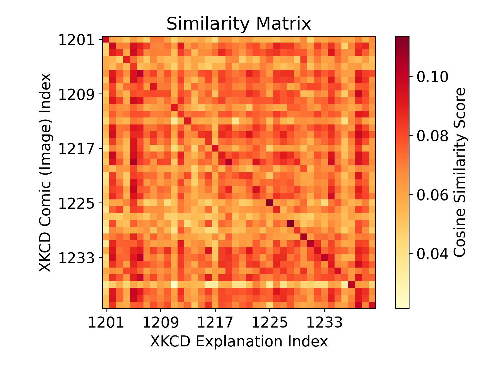

Embedding models are a popular topic at the minute, and lots of people are trying out (or selling) RAG. One of the things that has interested me is multimodal embeddings, and I wanted to see how easy and effective it would be for me. I thought that being able to retrieve a relevant XKCD in any situation seemed like a perfect way to try it out.

I’m not going to try and explain embeddings ([Simon Willison does a good job](https://simonwillison.net/2023/Oct/23/embeddings/)), but the idea behind many multimodal models is that text and images (or other formats like audio) are embedded into the same vector space. You’re then able to compare stored vectors of images or text to queries or either type. After a bit of reading the model around I tried out was the [Nomic embed (vision) v1.5](https://huggingface.co/nomic-ai/nomic-embed-vision-v1.5). It’s fully open source (including training code and data) which is great. The standard nomic-embed-v1.5 models generate vectors 768 floats long, and are relatively small and easy to run on your CPU (it's 130M parameters). They are very capable models, especially for their size.

The idea I wanted to test was to calculate an embedding for both the image of each XKCD, and some text of the transcription. Then I could provide an image or text as a query and find relevant XKCDs, which would be great as replies to messages from colleagues. After some googling it turns out I'm not the first person to build some kind of XKCD search engine, but multimodal embeddings might be cool.

The guys at [explainxkcd.com](https://www.explainxkcd.com/) have already transcribed every comic by hand and written an explanation with the relevant context and culture, which is a much richer and higher quality dataset than just OCR of the comic. Thanks to all who contribute that. Image URLs and the explainxkcd content for the first 2600 comics is on a [HuggingFace dataset](https://huggingface.co/datasets/olivierdehaene/xkcd) which saved me scraping them all.

I did this messing around in a Jupyter notebook, I won't reproduce everything in this post but the [notebook is here](https://github.com/danclaytondev/relevant-xkcd-post).

## Setting up embedding calculations

I first wanted to get the embeddings up and running, which was just a case of using the code in the readme on HuggingFace. The `transformers` Python library downloads the tokeniser/image processor and model weights automatically.

I defined a function for calculating text and image embeddings on a batch of data, which made it much easier to use. The functions looked like this:

```python
def calculate_text_embeddings(text_chunks: list[str]) -> torch.Tensor:
    """
    returns a N x 768 torch.Tensor
    """
    ...

def calculate_image_embeddings(image_paths: list[str]) -> torch.Tensor:
    """
    returns a N x 768 torch.Tensor
    """
    ...
```

The contents of those functions isn't that novel, [I've included them at the end](#extra-functions-to-calculate-embeddings). It’s worth pointing out that these functions normalise the final vectors they return (they have a magnitude of 1).

To test calculating some embeddings, I took the image the nomic readme on HF uses as an example which is two cats on a sofa. To find something which I hoped embeds differently, I got a picture of a spiky cactii in the desert.

|  |  |
| ----------------------------------------- | -------------------------------------------------------------------------------------------------------------------------------------- |

By themselves the embedding vectors aren’t really meaningful, but a score of similarities between two vectors is. Comparing the cat image to the cactus gives us a single similarity score with no reference of how similar that score means, so let’s compare the embedding of each image to the text **“an animal that’s nice to cuddle with”**.

> The Nomic model requires you to prefix text before calculating embeddings. So in this case the string passed into the tokenizer is `search_query:an animal that’s nice to cuddle with`. For the documents you want to query against you use `search_document`.

```python
image_embeddings = calculate_image_embeddings(
    ["test-images/cats.jpg", "test-images/desert.jpg"]
)
query_embedding = calculate_text_embeddings(
    ["search_query:an animal that’s nice to cuddle with"]
)

image_embeddings @ query_embedding.T
```

```markdown
tensor([[0.0667],
        [0.0367]])
```

The `@` operator performs a matrix multiplication, we are doing the dot product of each image vector with each text vector. The dot product effectively tells us how much the two vectors are pointing in the same direction, or how similar our embeddings are.

The first product, the query string with the cats, is nearly double the product with the cactii. Seems like our embedding model is working 😀. We would expect that the 'cuddly animals' string has more in common with the cats image than the desert.

<details><summary>Dot product or cosine similarity? (click to expand)</summary>

> People frequently query vector databases with 'cosine distance' or 'cosine similarity'. That's normally defined as:
>
> $$
> cos \theta = \frac{  \vec{v} \cdot  \vec{q}  }{ |\vec{v}| |\vec{q}| }
> $$
>
> where $\vec{v}$ and $\vec{q}$ are your query and document (or any two) vectors to compare. With this model setup, the embeddings vectors are normalised, so cosine similarity is equal to the dot product between the two vectors. We can easily calculate the dot product with a tensor of embeddings with the `@` operator. Cosine distance is just 1 - similarity.

</details>

## Loading the XKCD data

As with any task like this, the bulk of the work is getting your data prepared. Thankfully the hard work has mostly been done by others.
The XKCD data is on HuggingFace and jsonl, but HuggingFace auto-converts datasets to parquet as well. I'm a big fan of querying remote parquet files using DuckDB.

I've created an in-memory (we don't need to store a copy) table called xkcd which is the data from HuggingFace.

```python
duckdb.sql(
    "create table xkcd as select * from \
        'https://huggingface.co/datasets/olivierdehaene/xkcd/resolve/refs%2Fconvert%2Fparquet/default/train/0000.parquet' \
    "
)
```

```python
duckdb.sql(
    "select id, image_url, explanation \
    from xkcd \
    limit 3 offset 1200;"
).pl()
```

<div><style>
.table-wrapper {
    overflow-x: scroll;
}
.dataframe > thead > tr,
.dataframe > tbody > tr {
  text-align: right;
  white-space: pre-wrap;
}
</style>
<small>shape: (3, 4)</small><div class="table-wrapper"><table border="1" class="dataframe"><thead><tr><th>id</th><th>title</th><th>image_url</th><th>explanation</th></tr><tr><td>i64</td><td>str</td><td>str</td><td>str</td></tr></thead><tbody><tr><td>1201</td><td>&quot;Integration&nbsp;by&nbsp;Parts&quot;</td><td>&quot;https://imgs.xkcd.com/comics/i…</td><td>&quot;Integration&nbsp;by&nbsp;parts&nbsp;is&nbsp;an&nbsp;int…</td></tr><tr><td>1202</td><td>&quot;Girls&nbsp;and&nbsp;Boys&quot;</td><td>&quot;https://imgs.xkcd.com/comics/g…</td><td>&quot;This&nbsp;comic&nbsp;is&nbsp;a&nbsp;play&nbsp;on&nbsp;the&nbsp;po…</td></tr><tr><td>1203</td><td>&quot;Time&nbsp;Machines&quot;</td><td>&quot;https://imgs.xkcd.com/comics/t…</td><td>&quot;Cueball&nbsp;activates&nbsp;a&nbsp;time&nbsp;machi…</td></tr></tbody></table></div>

Now I have the data to generate embeddings (we will also need to download the image from the URL so we can load them into the vision embedding model, its in the full notebook). Before going about calculating embeddings for every comic straight away, I wanted to test whether the vision model could get much meaning from each comic, given that they all look pretty similar (stick people, a few panels and often computers etc).

To see whether the model could assign semantic meaning to the XKCD images (or 'read' the text in them), I picked a chunk of 40 comics and compared the image embedding for each comic with the embedding of text explanation of each of the 40.

```python
test_comics = duckdb.sql(
    "select id, image_url, explanation \
    from xkcd \
    limit 40 offset 1200;"
).pl()
# images are already fetched locally in xkcd-images/[id].jpg
test_comic_embeddings = calculate_image_embeddings(
    [f"xkcd-images/{xkcd_id}.jpg" for xkcd_id in test_comics["id"]]
)
test_explanation_embeddings = calculate_text_embeddings(
    [f"search_document:{explanation}" for explanation in test_comics["explanation"]]
)
similarity_matrix = test_comic_embeddings @ test_explanation_embeddings.T
```



The absolute values on the color scale are not important, but with the darker scores along the diagonal, we can see that the vision embeddings of each comic and its text description are much more related than they are to other XKCDs. The diagonal of the matrix represents the similarity between each comic's image embedding and its own corresponding text description embedding. This is very promising! We would hope to see something like this, the content in the description is extremely semantically similar to what is in the image.

## Generating embeddings for lots of comics

I wrote a little loop to go through and generate embeddings for a large number of XKCDs (2600), but we need somewhere to store the embeddings so we can retrieve them later! DuckDB has [built-in support](https://duckdb.org/docs/sql/functions/array.html) for vector (array) operations like inner product or cosine similarity. We can store our embedding vectors as a DuckDB array `FLOAT[768]`, and then find similarity or distance very easily.

I wanted to store them in a dedicated file so I can share the embeddings; you could do it differently. I created a very simple table to store the image and explanation embeddings with the comic ID - if we want the URL etc we can always do a join.

```python
duckdb.sql("ATTACH 'embeddings.db' as embed_db;")

duckdb.sql(
    """
    CREATE TABLE IF NOT EXISTS embed_db.xkcd_vectors(
        id INT PRIMARY KEY,
        image_embedding FLOAT[768],
        text_embedding FLOAT[768]
    );"""
)
```

With that table all we need is a loop to go through and calculate the embeddings for all the comics. We want to calculate multiple image or text embeddings at a time to make use of batching optimisations with the model and vectorisation with calculations and data wrangling. We can't do them all in one go as we will run out of RAM/VRAM.

```python
chunk_size = 20  # 20 comics at a time

# run 10 chunks - this can be changed as needed
for i in range(10):
    comics_to_embed = duckdb.execute("""
        select id, image_url, explanation
        from xkcd
        where xkcd.id not in (
            select id from embed_db.xkcd_vectors
        )
        and image_url is not null
        and image_url != 'https://imgs.xkcd.com/comics/'
        limit ?; """,
        [chunk_size],
    ).pl()

    if len(comics_to_embed) == 0:
        print("No comics to embed.")
        break

    # store the image locally so we can load into the model
    for comic in comics_to_embed.to_dicts():
        filename = f"xkcd-images/{comic["id"]}.jpg"
        if not os.path.isfile(filename):
            try:
                urllib.request.urlretrieve(comic["image_url"], filename)
                # Crude rate limit for XKCD website - be nice
                time.sleep(0.2)
                count_fetched = count_fetched + 1
            except TypeError:
                print(comic["id"], comic["image_url"])

    comic_embeddings = calculate_image_embeddings(
        [f"xkcd-images/{xkcd_id}.jpg" for xkcd_id in comics_to_embed["id"]]
    )

    explanation_embeddings = calculate_text_embeddings(
        [f"search_document:{text}" for text in comics_to_embed["explanation"]]
    )

    # Add 2 columns to the polars dataframe for the image and text embeddings
    comics_to_embed = comics_to_embed.with_columns(
        pl.Series(name="image_embedding", values=comic_embeddings.cpu().tolist()),
        pl.Series(name="text_embedding", values=explanation_embeddings.cpu().tolist()),
    )

    # Use the duckdb Python integration, which can load data from a Polars dataframe
    # referred to by a Python variable, like it is a table in the DB (nice).
    # This is MUCH faster than using executemany or a loop.
    duckdb.execute(
        "insert into embed_db.xkcd_vectors from \
        (select id, image_embedding, text_embedding from comics_to_embed); "
    )
```

So this loop will calculate and store the embeddings for a number of chunks at a time. The size and number of chunks is easily changed.

I ran this on a GPU and it was _fast™_. I didn't benchmark. The downloading of images took much much longer than calculating embeddings.

## Querying the embeddings

Now we have a DuckDB table with XKCD IDs and embedding vectors. We can use the duckdb `array_cosine_similarity` to sort the database embeddings, and take the top few.

> As mentioned above, using `array_inner_product` gives exactly the same result in this case.

### Text-to-text

I want find comics related to the phrase: **"there are lots of different competing vector databases let's make one to become the standard"**.

```python
query_string = (
    "search_query:there are lots of different competing vector databases "
    "let's make one to become the standard"
)
query_vector = calculate_text_embeddings([query_string]).tolist()[0]

duckdb.execute(
    "select xkcd.id, xkcd.title, \
    array_cosine_similarity(text_embedding, ?::float[768]) as similarity \
    from embed_db.xkcd_vectors \
    join xkcd on xkcd.id = embed_db.xkcd_vectors.id \
    order by similarity desc \
    limit 3;",
    [query_vector],
).pl()
```

<div><style>
.dataframe > thead > tr,
.dataframe > tbody > tr {
  text-align: right;
  white-space: pre-wrap;
}
</style>
<small>shape: (3, 3)</small><div class="table-wrapper"><table border="1" class="dataframe"><thead><tr><th>id</th><th>title</th><th>similarity</th></tr><tr><td>i64</td><td>str</td><td>f32</td></tr></thead><tbody><tr><td>927</td><td>&quot;Standards&quot;</td><td>0.740518</td></tr><tr><td>1974</td><td>&quot;Conversational&nbsp;Dynamics&quot;</td><td>0.666445</td></tr><tr><td>522</td><td>&quot;Google&nbsp;Trends&quot;</td><td>0.663124</td></tr></tbody></table></div>

So our most relevant comic according to an embedding similarity is this:


Maybe not such a good idea to make a new standard vector database then.

As another example, if we search for **"search_query:how have you never heard of this before?"**, we get [Ten Thousand (1053)](https://xkcd.com/1053/). That seems like it's working well.

### Image-to-image

The two above examples above are just comparing text embeddings to text embeddings. We can use image embeddings too. I first want to use a query image to find relevant XKCD images. Here is my query image of choice:


```python
query_image_embedding = calculate_image_embeddings(
    ["test-images/gromit-reading-the-paper.jpeg"]
).tolist()[0]

duckdb.execute(
    "select xkcd.id, xkcd.title, \
    array_cosine_similarity(image_embedding, ?::float[768]) as similarity \
    from embed_db.xkcd_vectors \
    join xkcd on xkcd.id = embed_db.xkcd_vectors.id \
    order by similarity desc \
    limit 3;",
    [query_image_embedding],
).pl()
```

The query code is almost identical, we just embed the image, pass it as a parameter like with text, and compare to the `image_embedding` column instead.

> In each of these examples I need to convince DuckDB (cast) my parameter really is an array of length 768. Not sure why.

The top results from the vector search are [799 (below)](https://xkcd.com/799/), [750](https://xkcd.com/750/) and [997](https://xkcd.com/997/), which all include a drawing of a newspaper. So that seems pretty relevant to my query!


### Cross-modal queries

Finally, we can compare a query to both the image and text embeddings in the database (or even the other way around):

```python
query_string = "search_query:bananas"
query_vector = calculate_text_embeddings([query_string]).tolist()[0]

duckdb.execute(
    "select xkcd.id, xkcd.title,  \
    (array_cosine_similarity(image_embedding, $vector::float[768])) as image_similarity, \
    (array_cosine_similarity(text_embedding, $vector::float[768])) as text_similarity, \
    (0.7 * image_similarity + 0.3 * text_similarity) as combined_similarity \
    from embed_db.xkcd_vectors \
    join xkcd on xkcd.id = embed_db.xkcd_vectors.id \
    order by combined_similarity desc \
    limit 3;",
    {"vector": query_vector},
).pl()
```

<div class="table-wrapper">

| id   | title                                            | image similarity | text similarity | combined similarity |
| ---- | ------------------------------------------------ | ---------------- | --------------- | ------------------- |
| 1949 | [Fruit Collider](https://xkcd.com/1949/)         | 0.0558           | 0.6635          | 0.2381              |
| 388  | [Fuck Grapefruit](https://xkcd.com/388/)         | 0.0588           | 0.6228          | 0.2280              |
| 236  | [Collecting Double-Takes](https://xkcd.com/236/) | 0.0419           | 0.6457          | 0.2230              |

</div>

In this example I have added a weighting to consider the similarity to the images more for sorting purposes. I found that whenever comparing across media (image to text etc) the similarity tended to be lower than text-to-text and image-to-image which isn't surprising. You can play around with the weightings or return the top result based on both image and text similarities.

> Something I considered was that you can, in theory, store a combined 'mean _image and text_' vector in the database in a single column. This works because dot product is distributive, so we could combine the vector first and then then compare to it, assuming they're normalised. In reality I think that's a bad idea because you're fixed into a single image/text weighting when you combine the vectors, but by storing separately we can change that weighting at query time.

All of these top 3 actually have bananas in so that's another query that seems to work well. I will admit that I have tried other queries that didn't produce such nice results but in general the results have been fantastic. It seems the `nomic-embed` models are very capable at embedding meaning across image and text.

If you want to try this out, the notebook I've used and duckdb database file are available [here](https://github.com/danclaytondev/relevant-xkcd-post). You will be able to calculate query embeddings on your CPU (but you'll want a GPU to embed thousands of examples). DuckDB seemed very fast at doing the array calculations, but I haven't bench marked it. DuckDB has [HNSW vector index support experimentally](https://duckdb.org/docs/extensions/vss.html) but I didn't need it, queries were fast enough.

I have used lots of other people's work here so just want to credit some of them:

- obviously [XKCD](https://xkcd.com) (Randall Munroe)
- [explainxkcd.com](https://explainxkcd.com) for explanations and transcriptions
- [HuggingFace dataset of the above](https://huggingface.co/datasets/olivierdehaene/xkcd)
- [Nomic AI models](https://huggingface.co/nomic-ai/nomic-embed-vision-v1.5)

[This blog post is also cool](https://blog.brunk.io/posts/similarity-search-with-duckdb/) if you want to learn more about using vectors in DuckDB. You can learn how to define a function inside DuckDB to calculate embeddings.

## Extra: Functions to calculate embeddings

Earlier I ommitted the contents of the `calculate_text_embeddings` and `calculate_image_embeddings` functions. Here they are in full:

```python
processor = AutoImageProcessor.from_pretrained("nomic-ai/nomic-embed-vision-v1.5")
vision_model = AutoModel.from_pretrained(
    "nomic-ai/nomic-embed-vision-v1.5", trust_remote_code=True
).to(device)


def calculate_image_embeddings(image_paths: list[str]):
    images = [Image.open(path) for path in image_paths]
    inputs = processor(images, return_tensors="pt")
    # Move inputs to GPU
    inputs = {k: v.to(device) for k, v in inputs.items()}

    image_emb = vision_model(**inputs).last_hidden_state
    return F.normalize(image_emb[:, 0], p=2, dim=1)


tokenizer = AutoTokenizer.from_pretrained("nomic-ai/nomic-embed-text-v1.5")
text_model = AutoModel.from_pretrained(
    "nomic-ai/nomic-embed-text-v1.5", trust_remote_code=True
).to(device)
text_model.eval()


def calculate_text_embeddings(text_chunks: list[str]):
    encoded_input = tokenizer(
        text_chunks, padding=True, truncation=True, return_tensors="pt"
    )
    # Move inputs to GPU
    encoded_input = {k: v.to(device) for k, v in encoded_input.items()}

    with torch.no_grad():
        model_output = text_model(**encoded_input)

    text_embeddings = mean_pooling(model_output, encoded_input["attention_mask"])
    text_embeddings = F.layer_norm(
        text_embeddings, normalized_shape=(text_embeddings.shape[1],)
    )
    return F.normalize(text_embeddings, p=2, dim=1)


def mean_pooling(model_output, attention_mask):
    token_embeddings = model_output[0]
    input_mask_expanded = (
        attention_mask.unsqueeze(-1).expand(token_embeddings.size()).float()
    )
    return torch.sum(token_embeddings * input_mask_expanded, 1) / torch.clamp(
        input_mask_expanded.sum(1), min=1e-9
    )
```

These are taken almost entirely from the `nomic-embed-vision-v1.5` example on HuggingFace. I have added some lines to move tensors to the GPU, if there is a better way to handle multi-device, I'd like to know. :)

The example Nomic gives includes a mean pooling function. The Nomic text embedding model outputs a vector embedding for _each token_ in the input sequence. We want a single vector for the whole text chunk, which is what mean pooling gives us. Mean pooling takes a mean over each embedding dimension (768 of them). I didn't have a reason to use a pooling method other than just the mean. I think other use cases might get better results with different approaches.
